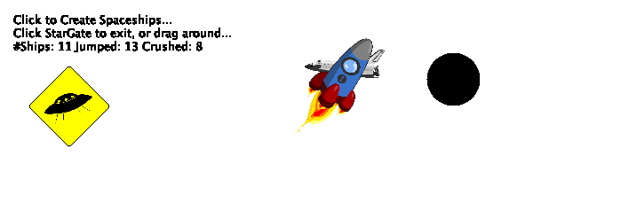

# README

## Description

Create space ships with a click of the mouse, and watch them teleport by wormhole or be crushed by gravity at random. Drag the wormhole about the system to force their chances. Exit the game by entering the wormhole yourself. StarGate keeps a tally of both total space ships and their fate.

## Instructions

Download, navigate to the StarGate folder and run the following from the command line

    java -jar "dist/StarGate.jar"

Requires [JDK/JRE](https://www.oracle.com/technetwork/java/javase/downloads/index.html), includes additional jar files.
 
